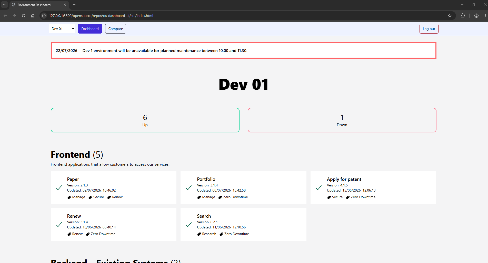
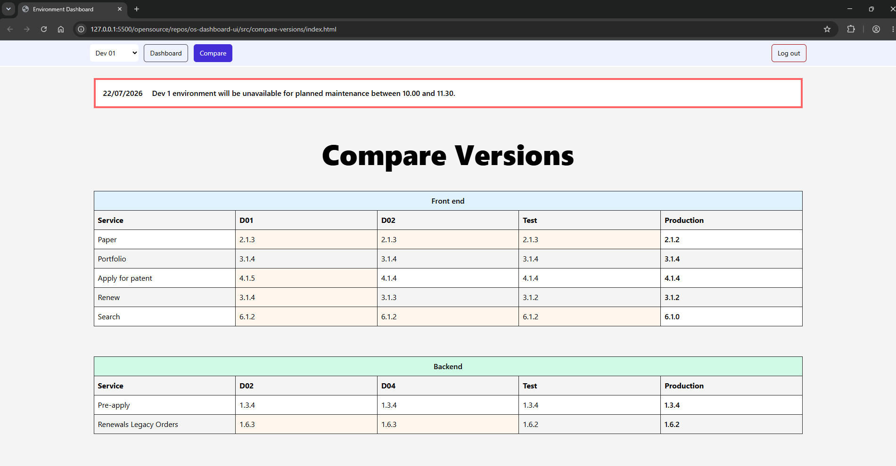

# Environment Dashboard UI Design

This is a HTML implementation of the UI design used for an environment dashboard that helps check the status of various microservices and track their progress through a release cycle.

## Dashboard

- The Dashboard screen shows a summary of the environment, including the services installed, the version and health.  It also shows available feature flags by status.
- The Navigation bar enables users to switch between environments.

### Compare Versions

- The compare versions screens gives a single overview of the versions deployed across environments on the route to live.
- New versions being progressed are highlighted in orange
- Different tables are used to help distinguish between service types.

### Dependancies
TailwindCSS https://tailwindcss.com/